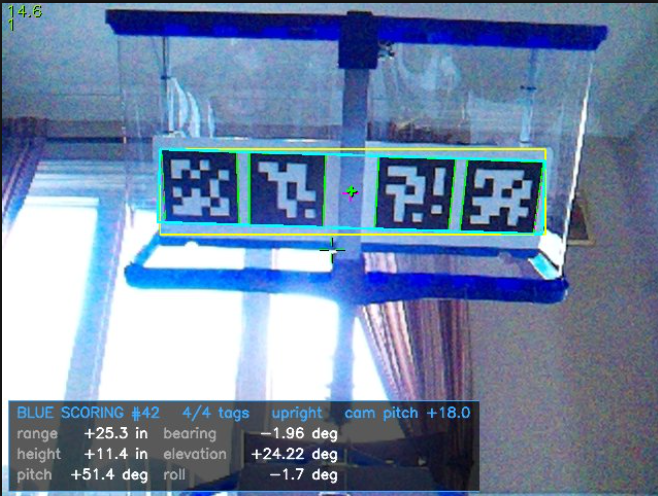

# BIOBUZZ AprilTag Cluster Detection for Limelight 3A

*Provided by Rocket Robotics, FTC 21615*



A Python SnapScript pipeline for the Limelight 3A. It finds your alliance's **AprilTag Clusters** and reports the **position of the cluster center** from any 1-4 visible tags.

| File | Purpose |
|---|---|
| `apriltag_cluster.py` | The Limelight pipeline (paste into the web UI) |
| `ClusterCenterTeleOp.java` | Sample FTC OpMode that reads the results |
| `test_apriltag_cluster.py` | Offline test with synthetic images (PC only) |
| `default.cal` | Camera calibration the script's constants come from |

## Setting up the Limelight

1. **Update** the Limelight to OS **2024.9.1 or newer**, which added AprilTag3 to Python pipelines.
2. **Open the web UI** at http://limelight.local:5801, with the Limelight plugged into your computer or the Control Hub.
3. **Choose a pipeline slot**, e.g. pipeline **1**. Its index must match `CLUSTER_PIPELINE` in the Java code.
4. **Set the pipeline type to Python:** on the **Input** tab, set *Pipeline Type* to **Python**.
5. **Load the script:** on the **Python Editor** tab, replace the code with the contents of `apriltag_cluster.py`, then click **Save**. Errors appear in the console below the editor.
6. **Adjust the image:** on the **Input** tab, raise exposure/gain until the tags are sharp and not blurred when the robot moves. The 3A has no LEDs. Any resolution works, because the calibration scales automatically.
7. **Configure the robot:** in the Driver Station robot configuration, add the Limelight under the Control Hub's USB devices with the name **`limelight`**.

Optional tuning, at the top of `apriltag_cluster.py`:

| Setting | Default | Effect |
|---|---|---|
| `DECIMATE` | `2.0` | How much the detector shrinks the image while searching for tags. Higher = faster, but tags must be closer to be detected. On a PC at 640×480: 1.0 → 15.6 ms, 2.0 → 3.8 ms with the same range in synthetic tests, 3.0 → 1.7 ms with range down to about 80%, 4.0 → 1.0 ms with range down to about 55%. |
| `READOUT` | `1` | `1` draws the readout box on the stream. `0` skips it, which is slightly faster, e.g. for matches. |
| `MIN_DECISION_MARGIN` | `20` | Ignore weakly decoded tags. Lower it if good tags at long range are rejected. Rejected tags are outlined in thin orange. |
| `MAX_HAMMING` | `1` | Ignore tags that needed more corrected bits than this |
| `CAL_K`, `CAL_DIST` | from `default.cal` | Camera calibration. See [Recalibrating](#recalibrating). |

## Inputs

Sent from the robot with `limelight.updatePythonInputs(double[])`:

| idx | value |
|---|---|
| 0 | **Alliance:** `1` = red (clusters 30 and 34), `0` = blue (clusters 38 and 42). Blue is the default, because inputs are all zeros until the robot sends them. |
| 1 | **Camera pitch** in degrees, **+ = tilted up** (0 = level, 90 = pointing straight up). Measure it on the robot. |

Only your alliance's two clusters are tracked. If both are in view, the **closer** one is reported, meaning the cluster containing the biggest tag in the image.

## Outputs

Read with `result.getPythonOutput()` (8 values):

| idx | value |
|---|---|
| 0 | cluster base ID: `30`, `34`, `38`, `42`, or **`-1` = no cluster** |
| 1 | number of tags of that cluster seen (1-4) |
| 2 | **range**: distance along the floor to the cluster center, inches. Use this for the shooter table. |
| 3 | **bearing**: degrees, **+ = left** (same sign as the FTC SDK) |
| 4 | **height** of the cluster center above the camera lens, inches |
| 5 | **elevation**: degrees, + = up = atan(height / forward) |
| 6 | **sticker pitch**: degrees, how far the sticker is tilted from flat. 0 = facing straight down, + = tilted to face toward the camera, 90 = facing the camera. Tells you whether the hive is tipped. |
| 7 | **roll**: degrees. `|roll| < 90` means the cluster is right-side up in the image. |

* Everything is measured from the camera lens and corrected for the camera pitch, as if the camera were level.
* Range is measured along the floor, so it doesn't include height. That differs slightly from the SDK's range, which is measured in the camera's own tilted view.
* If you need them, right and forward can be rebuilt: `right = -range·sin(bearing)`, `forward = range·cos(bearing)`.
* When the cluster is nearly straight overhead (range ≈ 0), bearing and elevation are unreliable, so use range and height.
* The pipeline also returns the cluster outline as its target. Limelight's standard tx/ty/ta, shown under the stream, aim at the cluster center but are **not** pitch-corrected.

**Compared with the FTC SDK's AprilTag output:**
- range, bearing and elevation correspond to its RBE;
- height corresponds to its Z;
- sticker pitch is its Pitch, but measured from flat instead of relative to the camera;
- roll is its Roll. The sign hasn't been checked against the SDK.

### The preview readout

The bottom-left box in the stream shows the same outputs:
- **Header:** cluster name and ID, tags seen, upright or upside down, and the pitch the robot sent.
- **Rows:** range/bearing, height/elevation, sticker pitch/roll.

Green outlines are tags in use, thin orange outlines are rejected tags, and the magenta cross is the cluster center.

## Sample Java code

`ClusterCenterTeleOp.java` is a complete OpMode. Pick the alliance during init with **B = red** or **X = blue**. The essential parts:

```java
private static final int CLUSTER_PIPELINE = 1;        // pipeline slot in the web UI
private static final double CAMERA_PITCH_DEG = 18.0;  // + = tilted up; measure on the robot
private static final double RED = 1, BLUE = 0;

Limelight3A limelight = hardwareMap.get(Limelight3A.class, "limelight");
limelight.pipelineSwitch(CLUSTER_PIPELINE);
limelight.start();

// Inputs: [0] alliance, [1] camera pitch
limelight.updatePythonInputs(new double[] {alliance, CAMERA_PITCH_DEG, 0, 0, 0, 0, 0, 0});

LLResult result = limelight.getLatestResult();
double[] py = (result != null) ? result.getPythonOutput() : null;
if (py != null && py.length >= 8 && py[0] >= 0) {
    int clusterId = (int) py[0];
    int tags      = (int) py[1];
    double range = py[2];         // inches along the floor -> shooter speed table
    double bearing = py[3];       // degrees, + = left
    double height = py[4];        // inches above the camera lens
    double elevation = py[5];     // degrees, + = up
    double stickerPitch = py[6];  // degrees, 0 = flat (hive level)
    double roll = py[7];          // degrees, |roll| < 90 = right-side up
} else {
    // no cluster of our alliance in view
}
```

---

## How it works

### Cluster geometry (Manual, Fig. 9-15)

```
 [n+0]   [n+1]        +        [n+2]   [n+3]      tag centers, inches from cluster center
 -6.50   -2.75     center      +2.75   +6.50      all on the horizontal centerline
```
* The tags are 3.25 in squares from the tag36h11 family.
* Clusters: **30-33** red scoring, **34-37** red audience, **38-41** blue audience, **42-45** blue scoring.

### The math

1. **Detect and filter.** AprilTag3 finds the tags. Tags from the other alliance and weak detections are dropped, and the rest are grouped by cluster.
2. **Undistort.** Each tag's 4 corners are converted to normalized camera coordinates, using the calibration and removing lens distortion.
3. **Solve the pose.** Each corner's position on the sticker is known exactly. `solvePnP` (IPPE, for planar targets) finds the cluster's pose, with the **cluster center as the origin**, using every visible corner.
   - One tag (4 corners) is enough.
   - With 2+ tags, the pose is refined with `solvePnPRefineLM`.
   - This still works when the center is in the blank gap between the middle tags.
4. **Correct for camera pitch.** The center's position is rotated out of the camera's tilted view into a level one: right, up and forward. From that:
   - `range = hypot(right, forward)`
   - `bearing = atan2(-right, forward)`
   - `height = up`
   - `elevation = atan2(up, forward)`
5. **Sticker pitch.** The direction the printed face points comes from the solved rotation, rotated the same way. Sticker pitch is its angle away from straight down, positive when it tilts toward the camera.
6. **Roll.** The center and a point 1 in along the cluster's x-axis are projected into the image. Roll is the angle of the line between them.

Example: with the camera pitched up 18°, a cluster 13.7° above the image center reports elevation = 18 + 13.7 ≈ 31.7°. This is exact when bearing ≈ 0.

### Recalibrating

`CAL_K` and `CAL_DIST` come from `default.cal`, which was calibrated at 1280×960. The script scales them to whatever resolution the pipeline runs at. After a new calibration, copy `INTRINSICS_MATRIX` and `DISTORTION_COEFFICIENTS` from the new `.cal` file.
- The file's coefficient order is OpenCV's `k1, k2, p1, p2, k3`.
- The web UI's P1/P2 labels show the two tangential terms the other way round.

### Testing on a PC

```bash
pip install opencv-python numpy pupil-apriltags
python test_apriltag_cluster.py
```
The test uses `pupil_apriltags`, which wraps the same AprilTag3 C library, as a stand-in for the Limelight's `apriltag` module. It renders the sticker through the calibrated lens, distortion included.

What it checks:
- 6 poses × all 15 visible-tag subsets, comparing range, bearing, height, elevation, sticker pitch and roll against ground truth
- camera pitch correction
- a tilted hive: sticker pitch of 0°, +20°, −15° and +45°, with the camera pitched 30°
- alliance filtering
- weak-detection filtering
- near-vs-far cluster selection

Result: 90/90 pass. Position is within 0.27 in at 24-34 in, bearing and elevation within about 0.1°, and sticker pitch within 1.6° from a single tag and 0.8° with 2-4 tags.

## License

Copyright © 2026 Maxim Vanier. Released under the [MIT License](LICENSE).
